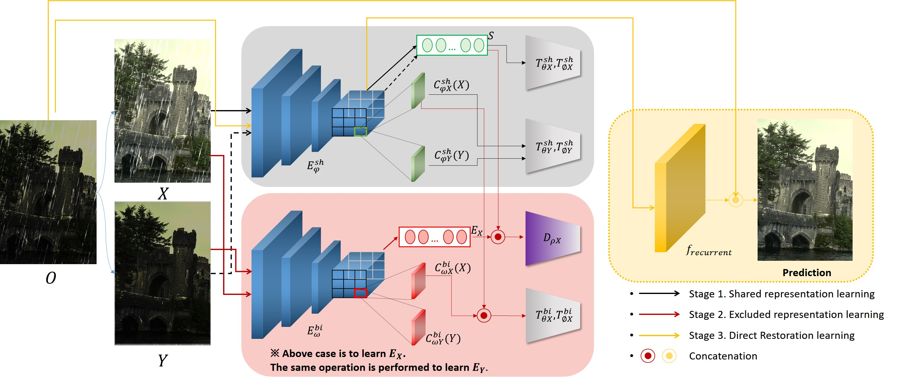
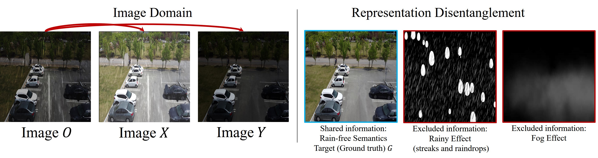
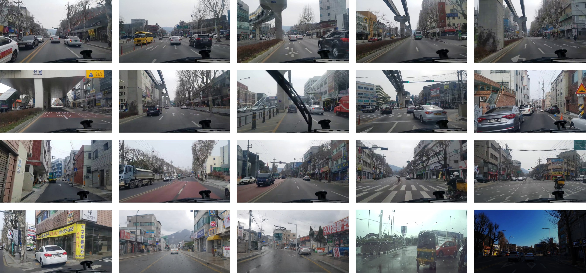
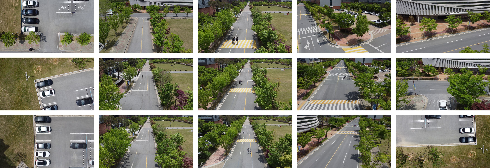
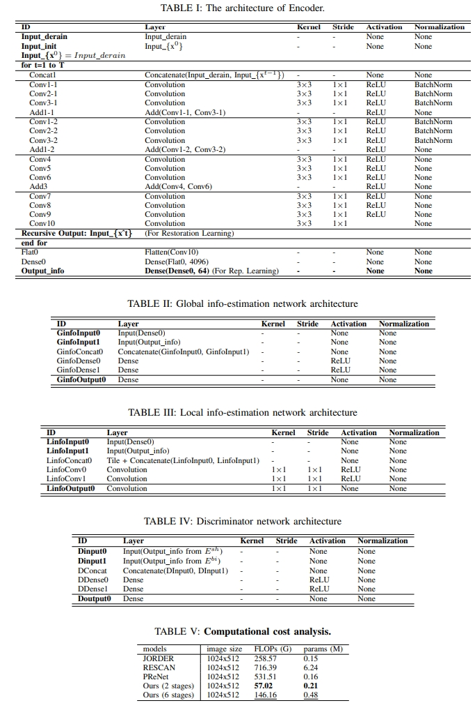

# Rain-VV


#### Younkwan Lee, Hyeongjun Yoo, Jongmin Yu, Moongu Jeon

This is the official website for "Learning to See in the Hazy Rain via Disentangled Representation (submitted to IEEE RA-L)", which is a newly built disentanglement framework for single image de-raining.


- Rain-VV Dataset
- Scenes: **traffic** and **drone**, Tasks: **Single image de-raining** and **object detection**
- If you are interested in de-raining, please refer to [our paper] or [our github project](https://github.com/brightyoun/Rain-VV).

## Table of Contents
0. [Abstract](#0)
1. [Rain-VV Dataset](#1)  
2. [Network Architecture](#2)  
   2.1 [LPST-110K Sample](#2.1)  
   2.2 [Full dataset](#2.2)   
3. [Benchmark](#3)  
   3.1 [AOLP Dataset](#3.1)  
   3.2 [PKU Dataset](#3.2)   
   3.3 [UFPR Dataset](#3.3)  
   3.4 [CCPD Dataset](#3.4)  
   3.5 [LTSP-110K Dataset](#3.5) 
4. [Comparisons](#4)  
   4.1 [Ablation Study](#4.1)
   4.2 [Comparisons with SOTA](#4.2)
5. [Citation](#5)  
6. [Evaluation on the test set](#6) 
7. [Contact](#7) 

## Abstract <a name="0"></a>
Image de-raining is an important task in many robot vision applications since rain effects and hazy air largely threaten the performance of visual analytics. While deep neural de-raining models have greatly boosted performance by learning rich representations of rainy input data, they are still likely to indicate incongruent information to spoil de-raining. We find that the process of extracting the feature representations in the rainy image space is surprisingly important for perceptual de-raining performance. We further probe the limitations of the universal restoration learning method and formulate explicitly relevant and irrelevant information onto feature representations. To handle this issue, we employ an information-theoretic concept to define disentangled representation which is divided into shared and excluded characteristics. Our key idea is to remove excluded feature representations from a set of co-occurrence features while preserving details using mutual information. To achieve this, we propose a novel stage-wise training strategy that captures a more discriminative and pure factor that preserves details. Specifically, we utilize an adversarial objective that explicitly defines each representation to enforce disentanglement. Extensive computational experiments on six benchmark datasets show the superiority of our new model against state-of-the-art methods.


## 1. Rain-VV Dataset <a name="1"></a>


The Rain-VV dataset is a newly collected dataset. The dataset totally contains 40 hours of diverse high quality samples collected in the Gwangju, Korea. For the aerial image of navigating drone, we collect 3,108 images (1,008 images for training and 2,000 images for testing) using DJI Air 2S drone. For the frontal image of moving vehicle, we collect 2,000 images (1,000 images for training and 1,000 images for testing) using Hyundai NF Sonata 2014.

### Annotations format
The CSV file with annotations should contain one annotation per line.
Images with multiple bounding boxes should use one row per bounding box.
Note that indexing for pixel values starts at 0.
The expected format of each line is:
```
path,x1,y1,x2,y2,class_name
```
 
## 2. Network Architecture <a name="2"></a>

In order to learn the shared and biased representation, we propose a new recursive network-like encoder. The architecture of the encoder $E^{sh}$ and $E^{bi}$ is shown in Table 1. For recursive setting, we set $T = 6$.



#### 2.1 LPST-110K Sample <a name="2.1"></a>
* SAMPLE 001 set:
    * images:
      [Google Drive](https://drive.google.com/file/d/1gCy0k7afMqYMuTjo4Vna2P_IfLLeRTdI/view?usp=sharing)
    * full annotations:
      [Google Drive](https://drive.google.com/file/d/1pmgP4ccrAGwRPfCDnJHG16Q72euH6nd8/view?usp=sharing)
    * license plate annotations:
      [Google Drive](https://drive.google.com/file/d/19o-4xX6Pk9y0QUK0CWuJso1vQF4Y33Nl/view?usp=sharing)
    * scene text annotations:
      [Google Drive](https://drive.google.com/file/d/19XVGtJXvRGqjij-w5kR4oVNNyWcgQ5c3/view?usp=sharing)
    * full images:
      [Google Drive](https://drive.google.com/file/d/16XAH_uDH-wmGMKVWdni2vSXU8zSTk6dL/view?usp=sharing)
      
* SAMPLE 002 set:
    * images:
      [Google Drive](https://drive.google.com/file/d/1iLFhmBT2JMK4ZKZZv8IK7wTa-Xnza5I8/view?usp=sharing)
    * full annotations:
      [Google Drive](https://drive.google.com/file/d/1yHOXeFY3WCasgtgXYQHGKL68Qw429IgY/view?usp=sharing)
    * license plate annotations:
      [Google Drive](https://drive.google.com/file/d/1JERu9Dy2YSQONV-xiR5kTD36AJA3bQ16/view?usp=sharing)
    * scene text annotations:
      [Google Drive](https://drive.google.com/file/d/1jlqKL5_4wOctYCS0X6rvm_df1ysndKCO/view?usp=sharing)
      
* SAMPLE 003 set:
    * images:
      [Google Drive](https://drive.google.com/file/d/1VFTH3uzcQMPyl9uCj5ScLVCWFAxyLyL7/view?usp=sharing)
    * full annotations:
      [Google Drive](https://drive.google.com/file/d/1XnXWa3NR5bjwO_cq5Gf2xLivpLUQ0fHI/view?usp=sharing)
    * license plate annotations:
      [Google Drive](https://drive.google.com/file/d/1qMIt3gBH5kDDER7OY1cKCtwY9A1JhBcS/view?usp=sharing)
    * scene text annotations:
      [Google Drive](https://drive.google.com/file/d/1RwKYCxylV4t7LJXBJplzzGfrAhfCENHi/view?usp=sharing)
      
 * SAMPLE 004 set:
    * images:
      [Google Drive](https://drive.google.com/file/d/1iLFhmBT2JMK4ZKZZv8IK7wTa-Xnza5I8/view?usp=sharing)
    * full annotations:
      [Google Drive](https://drive.google.com/file/d/1yHOXeFY3WCasgtgXYQHGKL68Qw429IgY/view?usp=sharing)
    * license plate annotations:
      [Google Drive](https://drive.google.com/file/d/1JERu9Dy2YSQONV-xiR5kTD36AJA3bQ16/view?usp=sharing)
    * scene text annotations:
      [Google Drive](https://drive.google.com/file/d/1jlqKL5_4wOctYCS0X6rvm_df1ysndKCO/view?usp=sharing)
      
* evaluation tools:
  [cocoapi](https://github.com/cocodataset/cocoapi)

#### 2.2 Full dataset <a name="2.2"></a>
To see full dataset, here's the Email and request Dataset [contact us](brightyoun@gist.ac.kr).
* evaluation tools:
  [cocoapi](https://github.com/cocodataset/cocoapi)


## 3. License Plate Detection Results on Benchmarks <a name="4"></a>

#### 3.1 AOLP Dataset <a name="3.1"></a>

* Results on AOLP

  |              | :AOLP         |           |              |           |              |           : |
  | method       | AC Precision | AC Recall | LE Precision | LE Recall | RP Precision | RP Recall  |
  | :----------- | :----------: | :-------: | :----------: | :-------: | :----------: | :--------: |
  | [Hsu et al. (T-VT, 2013)](https://ieeexplore.ieee.org/abstract/document/6339122/)         | 91.00        |  96.00    | 91.00        |  95.00    |  91.00       | 94.00      |
  | [Li et al. (Arxiv, 2016)](https://arxiv.org/abs/1601.05610)          | 98.53        |  98.38    | 97.75        |  97.62    |  95.28       | 95.58      |
  | [Selmi et al. (ICDAR, 2017)](https://ieeexplore.ieee.org/abstract/document/8270118)       | 92.60        |  96.80    | 93.50        |  93.30    |  92.90       | 96.20      |
  | [Rafique et al. (Soft Computing, 2018)](https://link.springer.com/article/10.1007/s00500-017-2696-2) | - |  98.09    | -            |  93.92    |  -           | 89.03      |
  | [Xie et al. (T-ITS, 2018)](https://ieeexplore.ieee.org/abstract/document/8253610)    | 99.51        |  99.51    | 99.43        |  **99.43**    |  99.46       | 99.46      |
  | [Li et al. (T-ITS, 2018)](https://ieeexplore.ieee.org/abstract/document/8424450)         | -            |  99.12    | -            |  99.08    |  -           | 98.20      |
  | [Bjorklund et al. (PR, 2019)](https://www.sciencedirect.com/science/article/pii/S0031320319301475)  | **100**  |  99.30  | **99.80** | 99.00 |  **99.80**  | **99.00**      |
  | [Selmi et al. (PRL, 2020)](https://www.sciencedirect.com/science/article/pii/S0167865519303216) | 99.30  |  99.40  | 99.20   |  99.20    |  98.90       | 98.80      |
  | **Ours**     | **99.71**        |  **99.80**    | **99.80**        |  **99.32**    |  **99.71**       | **98.79**      |
  

#### 3.2 PKU Dataset <a name="3.2"></a>

* Results on validation (Accuracy)

  | method                 | G1        | G2        |  G3       | G4        | G5        | Average   |
  | :--------------------- | :-------: | :-------: | :-------: | :-------: | :-------: | :-------: |
  | RetinaNet (Baseline)   | 96.67     | 97.29     | 96.77     | 96.68     | 95.34     | 96.34     |
  | [Zheng et al. (PRL, 2005)](https://www.sciencedirect.com/science/article/pii/S0167865519303216)  | 94.93     | 95.71     | 91.91     | 69.58     | 67.61     | 79.47     |
  | [Zhao et al. (ITSC, 2011)](https://ieeexplore.ieee.org/abstract/document/6082854/)                  | 95.18     | 95.71     | 95.13     | 69.93     | 68.10     | 80.29     |
  | [Zhou et al. (T-IP, 2012)](https://ieeexplore.ieee.org/abstract/document/6200342)                  | 95.43     | 97.85     | 94.21     | 81.21     | 82.37     | 90.22     |
  | [Li et al. (T-ITS, 2013)](https://ieeexplore.ieee.org/abstract/document/6547735)                   | 98.89     | 98.42     | 95.83     | 81.17     | 83.31     | 91.52     |
  | [Yuan et al. (T-IP, 2016)](https://ieeexplore.ieee.org/abstract/document/7752971)                 | 98.76     | 98.42     | 97.72     | 96.23     | 97.32     | 97.69     |
  | [Li et al. (T-ITS, 2018)](https://ieeexplore.ieee.org/abstract/document/8424450)                   | **99.88** | **99.86** | 99.60     | **100.0** | 99.31     | 99.73     |
  | [Bjorklund et al. (PR, 2019)](https://www.sciencedirect.com/science/article/pii/S0031320319301475) | 98.77     | 99.00     | 98.92     | 97.74     | -         | 98.61     |
  | [Selmi et al. (PRL, 2020)](https://www.sciencedirect.com/science/article/pii/S0167865519303216)    | 99.50     | 99.40     | 99.40     | 99.60     | 99.10     | 99.40     |
  | **Ours**               | **99.88** | **99.86** | **99.87** | 99.65     | **99.58** | **99.74** |
  

#### 3.3 UFPR Dataset <a name="3.3"></a>

* Results on validation (Recall)

  | method               | UFPR  |
  | :------------------- | :---: | 
  | RetinaNet (Baseline) | 97.22 | 
  | [Laroca et al. (IJCNN, 2018)](https://ieeexplore.ieee.org/abstract/document/8489629)             | 98.33 | 
  | [Laroca et al. (Arxiv, 2019)](https://arxiv.org/abs/1909.01754) | 98.67 | 
  | **Ours** | **99.17** | 

#### 3.4 CCPD Dataset <a name="3.4"></a>

* Results on validation (Precision)

  | method               | UFPR  |
  | :------------------- | :---: | 
  | RetinaNet (Baseline) | 94.10 | 
  | Faster R-CNN         | 92.90 | 
  | SSD300               | 94.40 |  
  | YOLO9000             | 93.10 |  
  | [Wang et al. (T-IFS, 2007)](https://ieeexplore.ieee.org/abstract/document/4202577/)                | 47.20 |  
  | [Li et al. (T-ITS, 2018)](https://ieeexplore.ieee.org/abstract/document/8424450)                  | 94.20 |  
  | [Xu et al. (ECCV, 2018)](https://openaccess.thecvf.com/content_ECCV_2018/html/Zhenbo_Xu_Towards_End-to-End_License_ECCV_2018_paper.html)   | 94.50 | 
  | **Ours**             | **96.10** | 

#### 3.5 LTSP-110K Dataset <a name="3.5"></a>

* LP Detection Results on validation (AP)

  | method               | AP       | AP75     |
  | :------------------- | :------: | :------: | 
  | Faster R-CNN         | .781     | .578     | 
  | SSD300               | .740     | .639     |
  | YOLO9000             | .729     | .625     |
  | RetinaNet (Baseline) | .863     | .769     |
  | + IF loss            | .905     | .885     |
  | + GRL                | .906     | .890     |
  | + LRM (**Ours**)     | **.911** | **.915** |

* non-LP Detection Results on validation (Precision, Recall)

  | method               | Precision | Recall   |
  | :------------------- | :-------: | :------: | 
  | Faster R-CNN         | 31.1      | 33.8     | 
  | SSD300               | 29.8      | 29.2     |
  | YOLO9000             | 30.5      | 23.9     |
  | RetinaNet (Baseline) | 37.3      | 32.1     |
  | + IF loss            | **19.1**  | 21.1     |
  | + GRL                | 21.5      | 21.0     |
  | + LRM (**Ours**)     | 20.2      | **15.3** |

## 4. Qualitative Results <a name="4"></a>

#### 4.1 Ablation Study <a name="4.1"></a>

* Ablation Study


#### 4.2 Comparisons with SOTA <a name="4.2"></a>
* Results on Various Benchmarks


* Results on LTSP-110K
<p align='left'></p>
<p align='center'></p>
<p align='right'></p>


## 5. Citation <a name="5"></a>

If this project help your research, please consider to cite our github page.

## 6. Evaluation on the test set <a name="6"></a>

Ablation studies can be conducted on the validation set.
If you would like to evaluate your model on the test set, you can send us (brightyoun@gist.ac.kr) your detection results in the `json` format.

## 7. Contact <a name="7"></a>

If you have any questions or want to add your results, please feel free to [contact us](brightyoun@gist.ac.kr).
