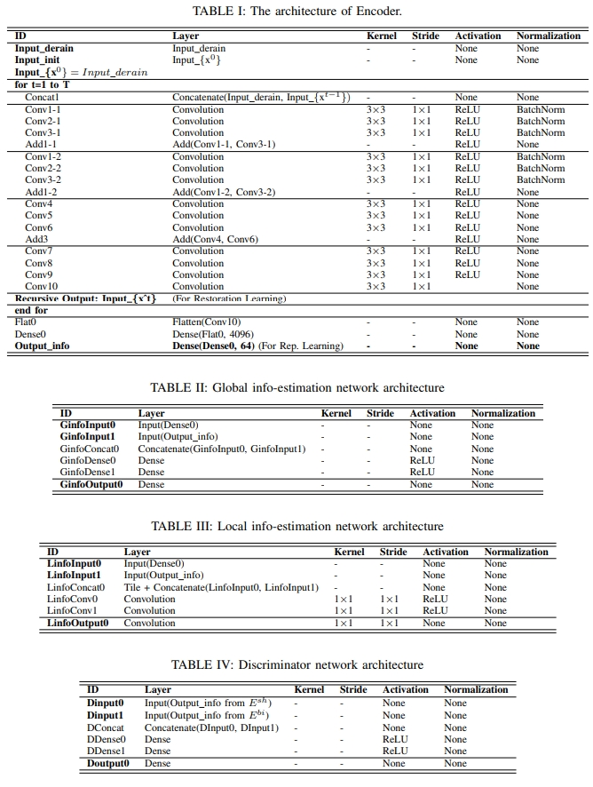

# Rain-VV


#### Younkwan Lee, Hyeongjun Yoo, Jongmin Yu, Moongu Jeon

This is the official website for "Learning to See in the Hazy Rain via Disentangled Representation (submitted to IEEE RA-L)", which is a newly built disentanglement framework for single image de-raining.


- Rain-VV Dataset
- Scenes: **traffic**, **Driving** and **drone**, Tasks: **Single image de-raining** and **object detection**
- If you are interested in de-raining, please refer to [our paper] or [our github project](https://github.com/brightyoun/Rain-VV).

## Table of Contents
0. [Abstract](#0)
1. [Rain-VV Dataset](#1)  
   1.1 [LPST-110K Sample](#2.1)  
   1.2 [Full dataset](#2.2)   
2. [Network Architecture](#2)   
3. [Computational Cost Analysis](#3)  
4. [Ablation Study Regarding Recursive Stages](#4)
5. [Additional Qualitative Experimental Results](#5) 
6. [Citation](#6)  
7. [Contact](#7) 

## Abstract <a name="0"></a>
Image de-raining is an important task in many robot vision applications since rain effects and hazy air largely threaten the performance of visual analytics. While deep neural de-raining models have greatly boosted performance by learning rich representations of rainy input data, they are still likely to indicate incongruent information to spoil de-raining. We find that the process of extracting the feature representations in the rainy image space is surprisingly important for perceptual de-raining performance. We further probe the limitations of the universal restoration learning method and formulate explicitly relevant and irrelevant information onto feature representations. To handle this issue, we employ an information-theoretic concept to define disentangled representation which is divided into shared and excluded characteristics. Our key idea is to remove excluded feature representations from a set of co-occurrence features while preserving details using mutual information. To achieve this, we propose a novel stage-wise training strategy that captures a more discriminative and pure factor that preserves details. Specifically, we utilize an adversarial objective that explicitly defines each representation to enforce disentanglement. Extensive computational experiments on six benchmark datasets show the superiority of our new model against state-of-the-art methods.


## 1. Rain-VV Dataset <a name="1"></a>


The Rain-VV dataset is a newly collected dataset. The dataset totally contains 40 hours of diverse high quality samples collected in the Gwangju, Korea. For the aerial image of navigating drone, we collect 3,108 images (1,008 images for training and 2,000 images for testing) using DJI Air 2S drone. For the frontal image of moving vehicle, we collect 2,000 images (1,000 images for training and 1,000 images for testing) using Hyundai NF Sonata 2014.

### Annotations format
The CSV file with annotations should contain one annotation per line.
Images with multiple bounding boxes should use one row per bounding box.
Note that indexing for pixel values starts at 0.
The expected format of each line is:
```
path,x1,y1,x2,y2,class_name
```
 
## 2. Network Architecture <a name="2"></a>

In order to learn the shared and biased representation, we propose a new recursive network-like encoder. The architecture of the encoder $E^{sh}$ and $E^{bi}$ is shown in Table 1. For recursive setting, we set $T = 6$.



#### 2.1 LPST-110K Sample <a name="2.1"></a>
* SAMPLE 001 set:
    * images:
      [Google Drive](https://drive.google.com/file/d/1gCy0k7afMqYMuTjo4Vna2P_IfLLeRTdI/view?usp=sharing)
    * full annotations:
      [Google Drive](https://drive.google.com/file/d/1pmgP4ccrAGwRPfCDnJHG16Q72euH6nd8/view?usp=sharing)
    * license plate annotations:
      [Google Drive](https://drive.google.com/file/d/19o-4xX6Pk9y0QUK0CWuJso1vQF4Y33Nl/view?usp=sharing)
    * scene text annotations:
      [Google Drive](https://drive.google.com/file/d/19XVGtJXvRGqjij-w5kR4oVNNyWcgQ5c3/view?usp=sharing)
    * full images:
      [Google Drive](https://drive.google.com/file/d/16XAH_uDH-wmGMKVWdni2vSXU8zSTk6dL/view?usp=sharing)
      
* SAMPLE 002 set:
    * images:
      [Google Drive](https://drive.google.com/file/d/1iLFhmBT2JMK4ZKZZv8IK7wTa-Xnza5I8/view?usp=sharing)
    * full annotations:
      [Google Drive](https://drive.google.com/file/d/1yHOXeFY3WCasgtgXYQHGKL68Qw429IgY/view?usp=sharing)
    * license plate annotations:
      [Google Drive](https://drive.google.com/file/d/1JERu9Dy2YSQONV-xiR5kTD36AJA3bQ16/view?usp=sharing)
    * scene text annotations:
      [Google Drive](https://drive.google.com/file/d/1jlqKL5_4wOctYCS0X6rvm_df1ysndKCO/view?usp=sharing)
      
* SAMPLE 003 set:
    * images:
      [Google Drive](https://drive.google.com/file/d/1VFTH3uzcQMPyl9uCj5ScLVCWFAxyLyL7/view?usp=sharing)
    * full annotations:
      [Google Drive](https://drive.google.com/file/d/1XnXWa3NR5bjwO_cq5Gf2xLivpLUQ0fHI/view?usp=sharing)
    * license plate annotations:
      [Google Drive](https://drive.google.com/file/d/1qMIt3gBH5kDDER7OY1cKCtwY9A1JhBcS/view?usp=sharing)
    * scene text annotations:
      [Google Drive](https://drive.google.com/file/d/1RwKYCxylV4t7LJXBJplzzGfrAhfCENHi/view?usp=sharing)
      
 * SAMPLE 004 set:
    * images:
      [Google Drive](https://drive.google.com/file/d/1iLFhmBT2JMK4ZKZZv8IK7wTa-Xnza5I8/view?usp=sharing)
    * full annotations:
      [Google Drive](https://drive.google.com/file/d/1yHOXeFY3WCasgtgXYQHGKL68Qw429IgY/view?usp=sharing)
    * license plate annotations:
      [Google Drive](https://drive.google.com/file/d/1JERu9Dy2YSQONV-xiR5kTD36AJA3bQ16/view?usp=sharing)
    * scene text annotations:
      [Google Drive](https://drive.google.com/file/d/1jlqKL5_4wOctYCS0X6rvm_df1ysndKCO/view?usp=sharing)
      
* evaluation tools:
  [cocoapi](https://github.com/cocodataset/cocoapi)

#### 2.2 Full dataset <a name="2.2"></a>
To see full dataset, here's the Email and request Dataset [contact us](brightyoun@gist.ac.kr).
* evaluation tools:
  [cocoapi](https://github.com/cocodataset/cocoapi)


## 3. Computational Cost Analysis <a name="3"></a>


Table 5 reports the computational cost of our proposed framework and some state-of-the-art methods. From the results, we can find that our method has less computational overload. Taking their hardware-friendly ability into account, it is appealing to still maintain de-raining and perception performance when facing foggy and rainy weather images. In the inference phase, our model achieves 21.6 fps (T=2: stages2) and 5.9 fps (T=6: stages 6) on one NVIDIA Jetson Xavier when input with a resolution of 1024 \times 512.

## 4. Ablation Study Regarding Recursive Stages <a name="4"></a>


At first, we set $T = 6$ for recursive stages of the encoder. In this section, we present a supplementary quantitative results why the stage is set to 6. Table 6 indicates their performance of de-raining performance on the Rain800, Rain1400, and Rain-VV benchmark. These results show that using six recursive stages show the outperforming performance.

In some cases, there are results that show better performance than when $T=6$. However, in general, when $T=6$, the performance is excellent, and when $T$ increases, the runtime of the proposed model is exponentially slow. Therefore, we generally adopt $T=6$, which shows a reasonable execution time while expressing excellent performance.

## 5. Additional Qualitative Experimental Results <a name="5"></a>

* Result 1

* Result 2

* Result 3

* Result 4

* Result 5

* Result 6


## 6. Citation <a name="6"></a>

If this project help your research, please consider to cite our github page.

## 7. Contact <a name="7"></a>

If you have any questions or want to add your results, please feel free to [contact us](brightyoun@gist.ac.kr).
